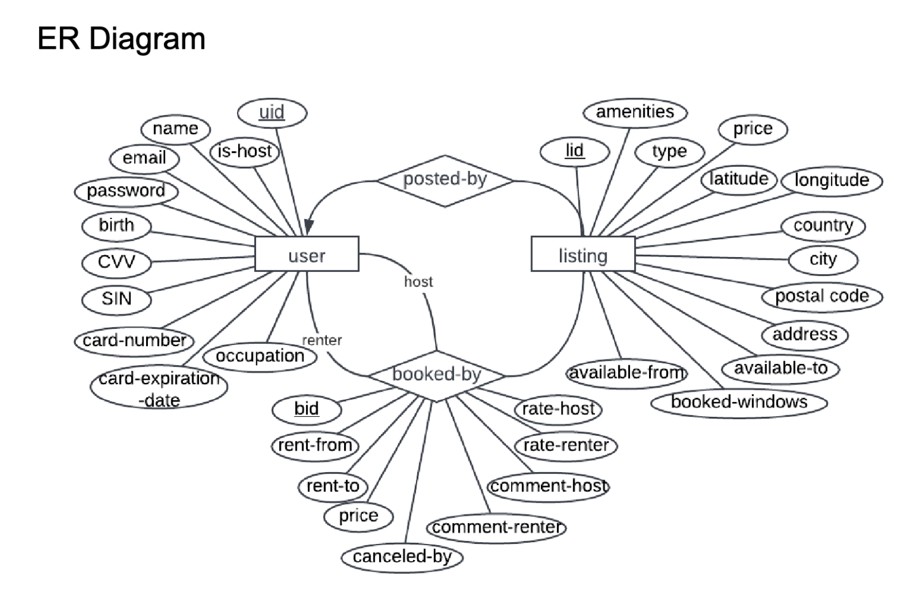

## Overview
This project designs a relational database, and backend implementations for supporting the operations of the a home sharing service platform (e.g. AirBnB).

### db Design
#### Relation Schema
- user(uid, name, email, password, birth, occupation, SIN, cardNumber, cardExpirationDate, CVV, isHost)
- listing(lid, h_uid, type, latitude, longitude, country, city, postalCode, address, amenities, price, availableFrom, availableTo)
- booking(bid, lid, r_uid, h_uid, rentFrom, rentTo, price, commentByHost, commentByRenter, rateByHost, rateByRenter, canceledBy)

#### Entity Relationship Diagram

*Primary keys are underlined

### backend features 
 4 categories of features are supported, see User Manual in docs.pdf for details.
- operations (e.g. add listing, create account, etc.)
- db queries (e.g. search listing)
- report generation (e.g. report hosts and renters with the largest #cancellations within a year)
- Host toolkit (e.g. suggesting price, amentities when creating listing)

## Dev Env Setup

### MySQL Server
- Install the MySQL community server according to your operating system(http://dev.mysql.com/downloads/mysql)

- Start MySQL service (Optional)
Windows: install_path/mysqld.exe –install
Linux: sudo systemctl start mysqld

- Test the installation
Windows: mysql.exe -p -u root
Linux/mac: mysql -p -u root

- Run command for db setup
• >>show databases;
• [Prints all the existing databases in your system]
• >>create database mydb;
• [Creating a new database 'mydb’]
• >>drop database mydb;
• [Delete the already existing database 'mydb’]
• >>use mydb;
• [Making database mydb, the default database into
which our command will be issued]

- LoadData to db
> source table
[load tables]
> source 
run mysql server
[load sample data]

### add library: mysql-connector-java-8.0.29.jar
> reference: https://www.youtube.com/watch?v=MtME-ERufu0
## Getting Started

Welcome to the VS Code Java world. Here is a guideline to help you get started to write Java code in Visual Studio Code.

## Folder Structure

The workspace contains two folders by default, where:

- `src`: the folder to maintain sources

- `lib`: the folder to maintain dependencies

Meanwhile, the compiled output files will be generated in the `bin` folder by default.

> If you want to customize the folder structure, open `.vscode/settings.json` and update the related settings there.

## Dependency Management

The `JAVA PROJECTS` view allows you to manage your dependencies. More details can be found [here](https://github.com/microsoft/vscode-java-dependency#manage-dependencies).
